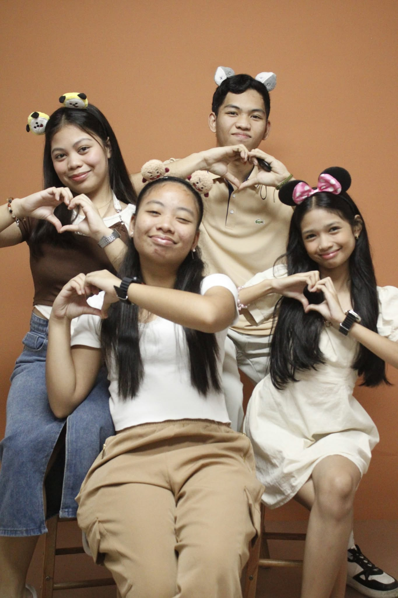
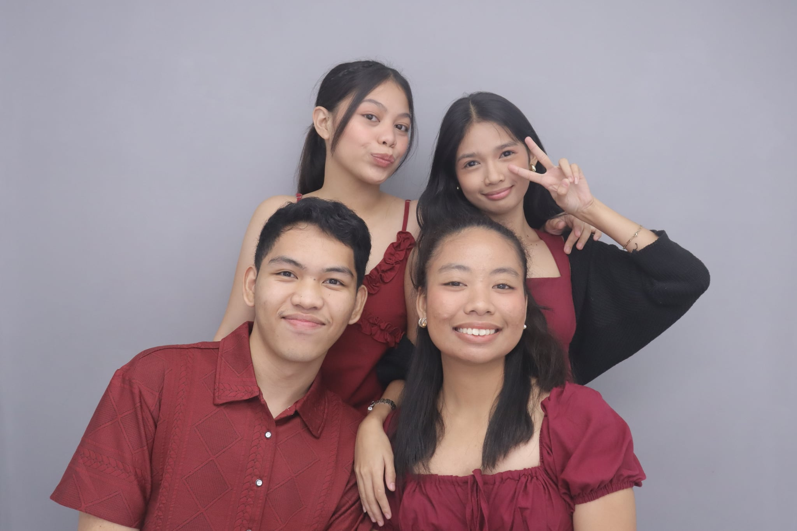
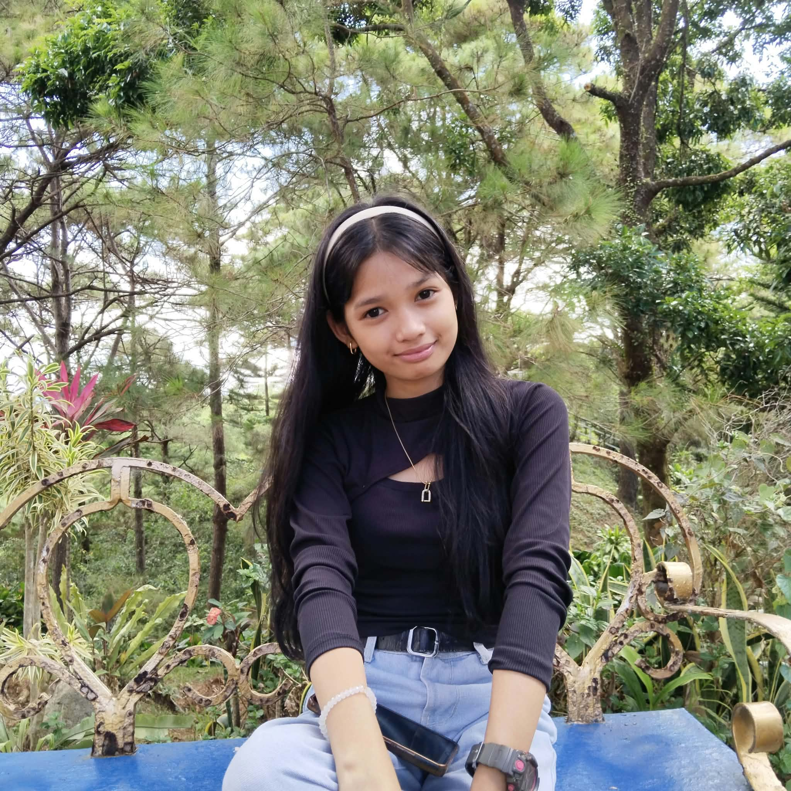
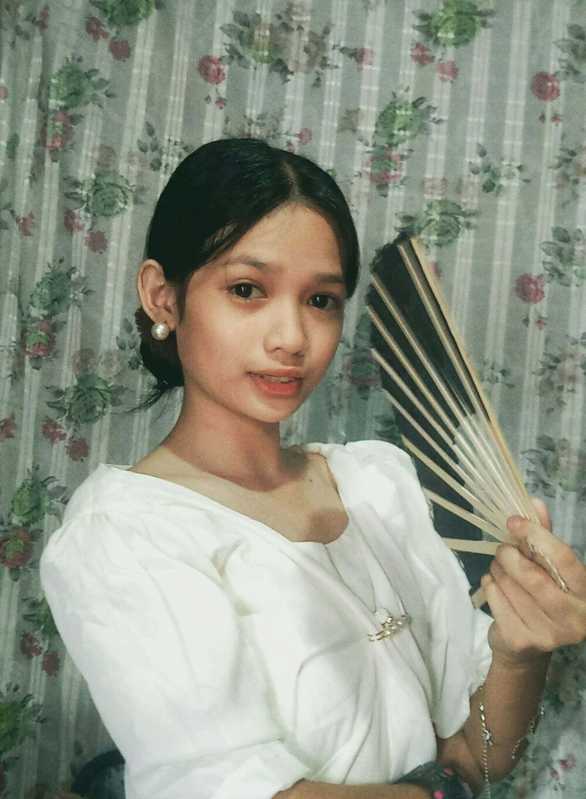
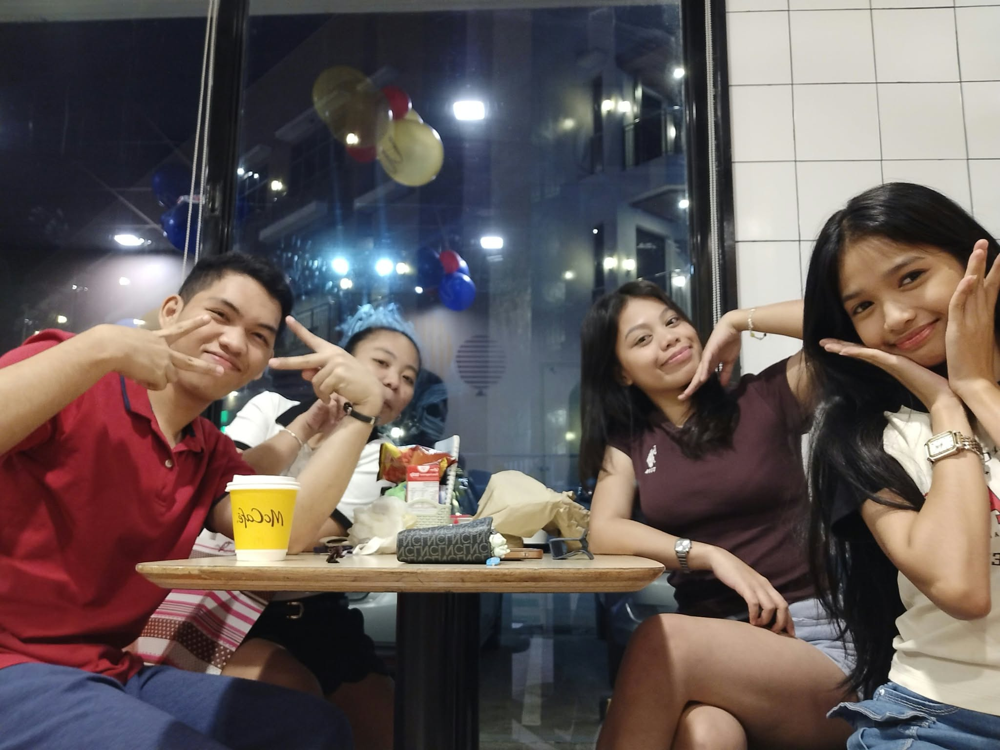
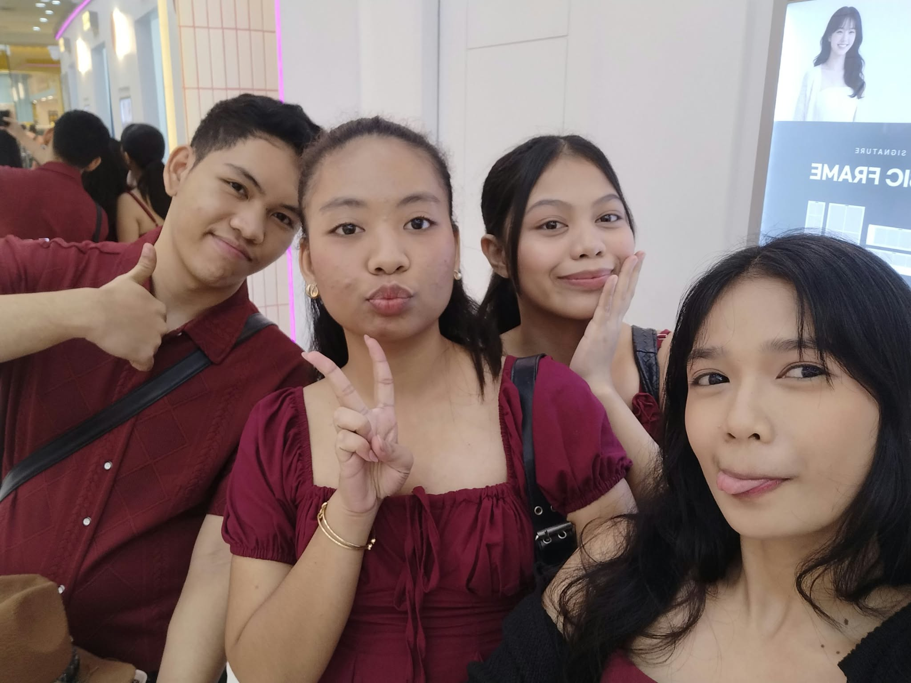

<!DOCTYPE html>
<html lang="en">
<head>
<meta charset="UTF-8">
<meta name="viewport" content="width=device-width, initial-scale=1.0">
<title>Happy Birthday 💗</title>

</head>
<body>

<nav>
  <a href="#home">Home</a>
  <a href="#message">Message</a>
  <a href="#photos">Photos</a>
  <a href="#wishes">Wishes</a>
</nav>

<main id="home" class="hero">
  

    
    
    Good Friends 💕
  

  

    🎀 A little birthday surprise 🎀
    
To Someone Special

    <h1>Happy Birthday Lauraine!</h1>
    
May your day be filled with happiness, love, laughter, and unforgettable memories. Keep being the amazing person that you are! 💗

    <button class="btn" onclick="openSurprise()">💗 Open Your Surprise</button>
    

      
You are so special! ✨

      
Keep Smiling! 🌸

    

  

  

    
    
    Stay Cute 💗
  

</main>

<section id="message">
  <h2 class="section-title">A Special Message</h2>
  

    

      Happy Birthday Lauraine! 🎂💗  
      I just want to say how thankful I am to have a friend like you.
Thank you for all the laughs, random conversations, unforgettable memories, and for always being there whenever we need someone to talk to. 🤝
  
I hope you enjoy your special day and get everything you’ve been wishing for. Wishing you good health, happiness, success, and more blessings in life. And don’t pressure yourself too much, especially about the things that haven’t come yet. Take your time, enjoy every moment, and trust God’s timing. Sometimes, things don’t happen when we expect them to, but God has a plan for everything. Just keep doing your best, keep praying, and trust that He will give you what’s meant for you at the right time. 🤍
  
Stay the same crazy, funny, and amazing person that you are! More memories, gala, tawanan, at kalokohan together! HAHAHA. Happy Birthday, Chi! Enjoy your day! 🎉
        
      <strong>Enjoy your birthday and always remember that you are special! 🎀</strong>
    

  

</section>

<section id="photos">
  <h2 class="section-title">Our Little Memories</h2>
  

    
    
    
    
    
    
  

</section>

<section id="wishes">
  <h2 class="section-title">Birthday Wishes</h2>
  

    

🌸
<h3>Happiness</h3>
May your days be filled with genuine smiles and beautiful moments.

    

🙏
<h3>More Blessings</h3>
May God continue to guide you and bless every step of your journey.

    

✨
<h3>Your Dreams</h3>
May the dreams in your heart slowly become beautiful realities.

  

</section>

<footer>
  Made with 💗 just for you • Happy Birthday! 🎂
</footer>

</body>
</html>
